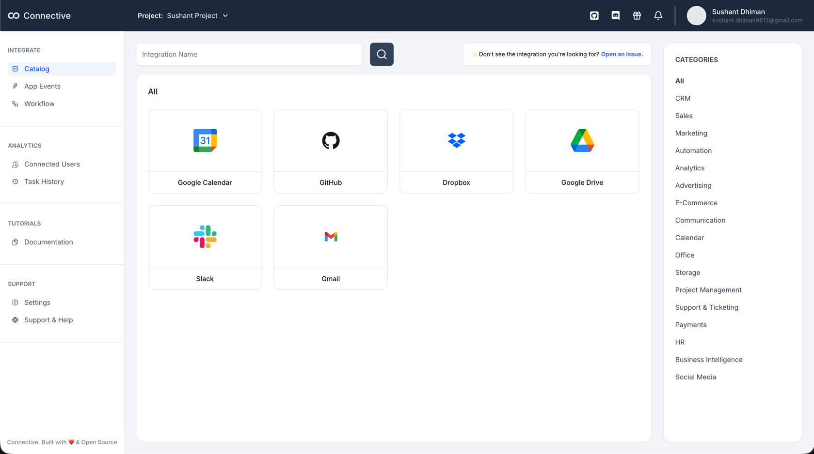
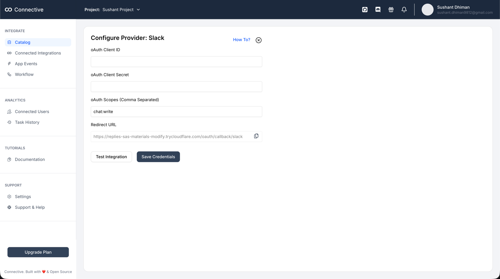
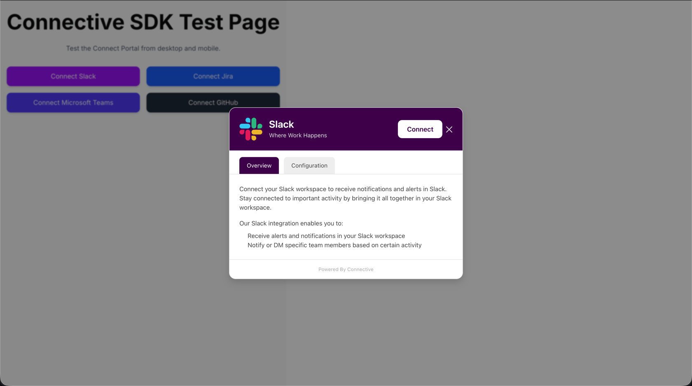

<div align="center">
<h2>Connective - Integration Infrastructure for every product</h2>
</div>

**Connective** is an open-source, developer-friendly platform that enables SaaS teams to offer plug-and-play third-party integrations directly inside their product with minimal engineering effort.

### See how it works:
Suppose you want to integrate **Slack** into your SaaS to send messages to your users.

1. Select **Slack** from the **Connective Dashboard**.  
   <br>
   
   <br><br>
2. Add Slack OAuth **Client ID** & **Client Secret**.  
   <br>
   
   <br><br>

3. Use the **Connective SDK** inside your product:
    ```typescript
    const sdk = createConnective({
        projectId: "",
        userId: "",
        baseURL: "http://localhost:8082", // Backend URL
        projectSecret: "",
    });
    
    const handleConnect = (provider: string) => {
        sdk.open({ provider });
    };
    ```

4. This opens the Connect Portal, where users can authenticate & connect Slack.
   <br><br>
   
   <br> <br>

5. Once connected, you can perform actions like sending messages, viewing channels, etc.
   Connective handles OAuth, token refresh & re-authentication automatically.
   Other integrations work the same way.


### Use Cases

Connective is being built for real-world automation & integration workflows:

#### 1. Backend Integration Platform
Use a single SDK to connect Slack, GitHub, Notion, etc., without writing OAuth, token refresh, and API clients repeatedly.

#### 2. Workflow Automation Engine
Chain actions like:

When a GitHub PR is merged → send Slack notification → update Notion task

#### 3. Build SaaS Integrations Faster

If you're building a SaaS product that needs 3rd-party integrations, Connective can act as the integration layer.

#### 4. Tools & Bots

Quickly build bots like:
* Slack Bot for notifications
* GitHub issue triggers → Discord alerts
* Google Sheets → Slack Reporting

#### 5. Event & Webhook Driven Systems
Future support for event hooks:
On Slack Message → Run function → Store in DB

### ❗IMPORTANT
This source code is very minimal prototype of **Connective** it lags a lot of basic features. This is to showcase the product and get early reviews. Before you criticise incomplete implementation let's be nice to each other, give me your reviews and I'll make **Connective** better.

You can open issues if you have any suggestions.

### 🎉 Be Part of the Community

Help shape the future of the project!
Whether you're contributing code, suggesting features, or just curious — our Discord is the place to be.

[👉 Join Discord](https://discord.gg/9uwbKse6)

### Current Implementation
**Connective** is currently in it's very early development phase. As of now it only supports few integrations. Also actions can't be performed only integration can be done. **It is not ready for production use at this time.**

### Future Planning
I'm planning to add following features in the future:
* Actions - Call 3rd party integration APIs directly from SDK.
* Workflow Builder - Automate Stuff
* App Events - Send custom events from you app and trigger actions.
* Webhook Triggering - Do stuff when something happens in 3rd party integration.


### Contribute / Feedback

I'm building this in public and would love feedback!
You can help by:

⭐ Starring the repo <br>
🧩 Opening issues with suggestions <br>
💬 Reviewing architecture/pr design <br>
🛠 Contributing connectors or improvements
